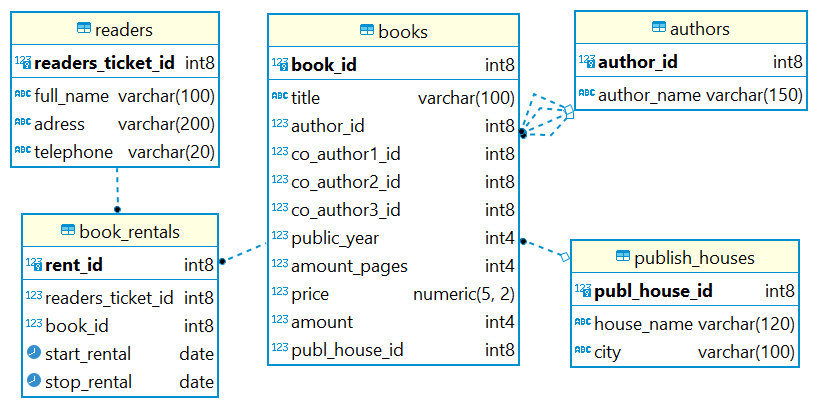

# Задание 1.
## Разработать физическую структуру БД. 
Физическая структура содержит:
- таблицы
- связи между таблицами
- первичные и внешние ключи
- тип атрибутов сущностей согласно выбранной СУБД.

# Задание 2. 
## Используя DDL, написать SQL-запрос создания всех таблиц со связями, первичными и внешними ключами.

Файл: [SQL-script](init.sql)